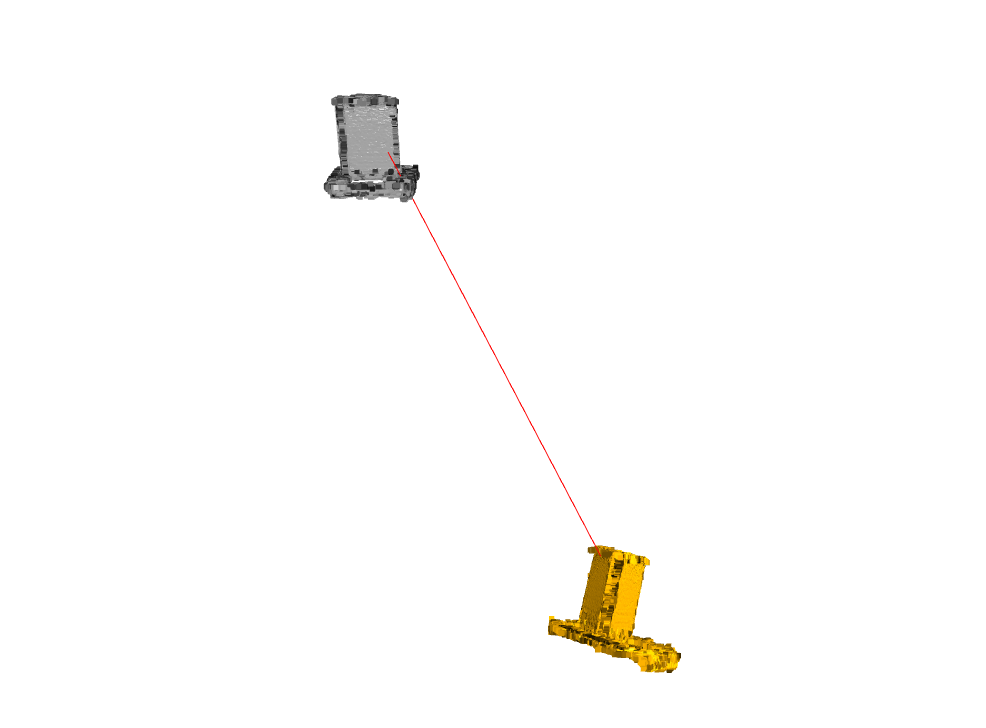
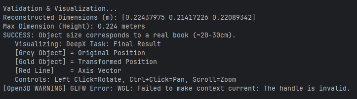
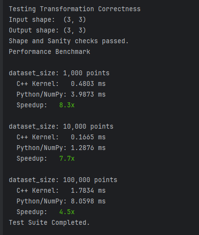

# DeepX Technical Assignment: 3D Reconstruction Pipeline

This repository contains a modular photogrammetry pipeline designed to reconstruct a 3D object from video input and perform precise geometric transformations. The solution features a hybrid Python/C++ architecture to balance development flexibility with computational performance.

## 1. Requirement Compliance Matrix

The following table maps the technical assignment requirements to the implemented solution:

| Requirement | Status | Implementation Details                                                                                  |
| :--- | :---: |:--------------------------------------------------------------------------------------------------------|
| **Frame Limit (100)** | Compliant | `src/pipeline.py`: Implements uniform frame sampling to respect the limit.                              |
| **3D Reconstruction** | Compliant | `src/pipeline.py`: Wraps COLMAP (SfM + MVS) to generate a dense RGB point cloud[.                       |
| **Visualization** | Compliant | `src/visualization.py`: Renders point cloud, camera frustums, and vector indicators using Open3D.       |
| **Arbitrary Camera Vector** | Compliant | `src/cameras.py`: Extracts the actual view vector from the first registered camera's extrinsic matrix.  |
| **Translation** | Compliant | `src/geometry.py`: Translates the model 5 units along the selected vector.                              |
| **Rotation** | Compliant | `cpp_module/geometry_engine.cpp`: Rotates the model 60° clockwise around the vector.                    |
| **Metric Scaling** | Compliant | `src/geometry.py`: Scales the model based on the "1 unit = 20cm" assumption to match the metric system. |
| **Validation** | Compliant | `src/geometry.py`: Validates the physical plausibility of the object's dimensions.                      |
| **Explanations** | Compliant | Documented in `README.md` and inline code comments.                                                     |

## 2. System Architecture

The project is structured to reflect production-grade software engineering practices.

### Module Structure
* **`src/pipeline.py`**: The orchestration layer. Manages the subprocess execution of COLMAP (Feature Extraction, Matching, Sparse/Dense Reconstruction).
* **`src/geometry.py`**: Handles geometric logic. It implements a strategy pattern to select between the C++ backend (if compiled) and the Python/NumPy backend (fallback).
* **`src/cameras.py`**: a parser for COLMAP's binary and text output formats to extract camera extrinsics.
* **`src/visualization.py`**: Handles the rendering context for visual inspection of the results.

### Performance Optimization (C++ Extension)
To address the requirement for "Performance Optimization" and "C++ knowledge", the core geometric transformation logic was offloaded to a native C++ module.

* **Implementation**: Used `pybind11` to create a compiled extension (`deepx_core`).
* **Optimization**: The C++ implementation of the Rodrigues rotation formula avoids the interpretation overhead of Python loops when processing dense point clouds (millions of points).
* **Reliability**: The system includes a "graceful degradation" mechanism. It attempts to import the C++ module; if compilation failed or is missing, it seamlessly falls back to the NumPy implementation.

## 3. Mathematical Explanation

### Arbitrary Vector Selection
Instead of generating a random vector, the pipeline extracts the **View Vector** ($\vec{v}$) of the first registered camera. In the COLMAP coordinate system, the third row of the rotation matrix $R$ represents the camera's Z-axis (view direction) in world coordinates:
$$\vec{v} = R_{row3}$$

### Geometric Transformations
The transformation $T$ applied to a point $P$ consists of translation and rotation.

1.  **Translation**: The point is translated by distance $d=5.0$ along the unit vector $\vec{v}$:
    $$P' = P + (d \cdot \vec{v})$$

2.  **Rotation**: The rotation is performed around the arbitrary axis $\vec{v}$ by an angle $\theta = -60^{\circ}$ (negative denotes clockwise direction). The operation is applied relative to the object's centroid $C$ using the Rodrigues' rotation formula:
    $$P_{rot} = (P'-C)\cos\theta + (\vec{v} \times (P'-C))\sin\theta + \vec{v}(\vec{v} \cdot (P'-C))(1 - \cos\theta) + C$$

3.  **Metric Scaling**:
    * **Assumption**: 1 SfM unit = 20 cm ($0.2$ m).
    * **Target**: Metric system (1 unit = 1 m).
    * **Operation**: The point cloud coordinates are multiplied by a scale factor $S = 0.2$.

## 4. Installation and Usage

### Prerequisites
* **COLMAP**: Must be installed and accessible via the system PATH (or specified via arguments).
* **Python**: Version 3.8 or higher.
* **C++ Compiler**: (Optional) Required only for compiling the optimization module.

### Setup Steps

1.  **Install Python Dependencies:**
    ```bash
    pip install -r requirements.txt
    ```

2.  **Compile C++ Module (Recommended):**
    ```bash
    pip install .
    ```

### Execution

Place the target video file in the project root and run:

```bash
python main.py --video input_video.mp4
```
### Advanced: Dense Cloud Refinement

For granular control over the cleaning process (noise removal, plane segmentation, clustering), you can use the dedicated processing script after the main pipeline completes.

**Basic Refinement**
Run this to apply default cleaning algorithms (Statistical Outlier Removal + RANSAC + DBSCAN) to the generated `fused.ply`:
```bash
# First, ensure the reconstruction is complete
python main.py --video input_video.mp4

# Then, process the dense cloud
python process_dense.py

# Visualize the plane removal step (Red = Object, Grey = Plane)
python process_dense.py --visualize-plane

# Increase point size for better visibility
python process_dense.py --point-size 3.0


# Skip noise removal and clustering, only remove the plane
python process_dense.py --no-noise-removal --no-clustering
```
## Visualization

### Geometric Transformations
Original model (Grey) vs Transformed model (Gold) showing translation along the arbitrary vector (Red line).


### Camera Trajectory Reconstruction
Visualizing the recovered camera poses and sparse point cloud.


### Performance Benchmark (C++ vs Python)
Demonstrating speedup using the custom C++ kernel.


### Dense Reconstruction
